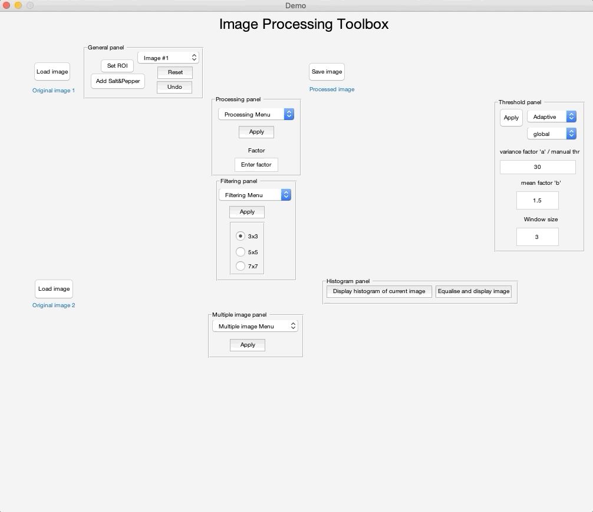

# ImageProcessing-Toolbox

- GUI for visualising various image processing techniques, including linear and non-linear filtering, thresholding and histogram equalisation.
- The tool was develop in MATLAB as part of the ECS776 module at Queen Mary University of London. 

## Examples:
#### Apply histogram equalisation and edge detection in a ROI of the selected image

#### Example of adaptive filtering using local variance and global mean

#### Arithmetic operations between two images

